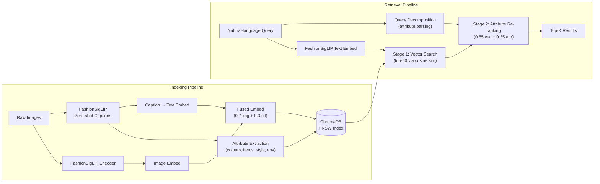

# Glance — Multimodal Fashion & Context Retrieval System


> A multimodal image retrieval system that finds fashion images by
> understanding **what you wear**, **what colour it is**, and **where you are**
> — all from a single natural-language sentence.

---

## Overview

**Glance** goes beyond vanilla CLIP retrieval with three key innovations:

| Innovation | What it does |
|---|---|
| **FashionSigLIP embeddings** | Uses [Marqo FashionSigLIP](https://huggingface.co/Marqo/marqo-fashionSigLIP), a CLIP variant fine-tuned on fashion data via Generalized Contrastive Learning across 7 fashion dimensions — dramatically better at distinguishing garment types, textures, and styles than generic CLIP. |
| **Zero-shot fashion captions** | The *same* FashionSigLIP encoder scores each image against colour / garment / scene / style prompts — **no separate BLIP/BLIP-2 download** (avoids 2–15 GB waits). Top attributes become a caption for fusion + re-ranking. |
| **Attribute-aware re-ranking** | Stage 1 retrieves 50 candidates via vector similarity; Stage 2 re-ranks with vector similarity (0.65) + attribute match (0.35), including **compositional** colour↔garment checks (e.g. preferring a red *tie* over bag-of-words co-occurrence). |

The result: queries like _"a red tie and white shirt in a formal setting"_ surface images that match on **garment**, **colour**, and **scene** — not just vague visual similarity.

---

## Architecture



---

## Project Structure

```
glance/
├── config.py                   # Centralised paths, model IDs, hyperparameters
├── download_dataset.py         # Fashionpedia downloader with progress bar
├── requirements.txt            # Python dependencies
├── README.md                   # ← you are here
│
├── indexer/                    # Indexing pipeline
│   ├── __init__.py
│   ├── caption_generator.py    # BLIP image captioning (~1 GB, not BLIP-2)
│   ├── embedding_generator.py  # FashionSigLIP encoder (image + text)
│   ├── attribute_extractor.py  # Rule-based attribute extraction from captions
│   ├── vector_store.py         # ChromaDB persistence layer
│   └── index_pipeline.py       # End-to-end indexing orchestrator
│
├── retriever/                  # Retrieval pipeline
│   ├── __init__.py
│   ├── query_decomposer.py     # Parse query → structured attributes
│   ├── search_engine.py        # Stage-1 vector + optional metadata filter
│   ├── reranker.py             # Attribute / compositional Stage-2 re-ranking
│   └── retrieve_pipeline.py    # End-to-end retrieval orchestrator
│
├── evaluation/                 # Evaluation & demos
│   ├── __init__.py
│   ├── evaluate.py             # Benchmark 5 queries → formatted report
│   └── demo.py                 # Interactive CLI demo
│
└── data/                       # Created at runtime
    ├── images/                 # Fashionpedia images
    └── chromadb/               # Persisted vector index
```

---

## Quick Start

### 1. Clone the repository

```bash
git clone https://github.com/kwazzy-coder/Glance-Fashion-Retrieval.git
cd Glance-Fashion-Retrieval
```

### 2. Install dependencies

```bash
pip install -r requirements.txt
```

> **GPU recommended.** A CUDA-capable GPU with ≥ 4 GB VRAM makes indexing
> (BLIP captioning) significantly faster. The system falls back to CPU
> automatically.

### 3. Download the dataset

```bash
python download_dataset.py            # default: 1 000 images
python download_dataset.py --count 500  # or fewer for a quick test
```

This **streams** the Fashionpedia validation split from Hugging Face
(does **not** pull the 15 GB train archive) into `data/images/`.

### 4. Index the images

```bash
python -m indexer.index_pipeline
```

Indexing uses FashionSigLIP for **both** zero-shot captions and embeddings
(no BLIP/BLIP-2 download), extracts attributes, and stores everything in ChromaDB.

> **Why no BLIP?** Captions come from FashionSigLIP zero-shot probes against a
> fashion attribute prompt bank. Same model, better fashion signal, ~0 extra GB.

### 5. Run the evaluation

```bash
python -m evaluation.evaluate
```

### 6. Interactive demo

```bash
python -m evaluation.demo
```

Type any natural-language fashion query and see ranked results with
scores, matched attributes, and decomposed query dimensions.

---

## How It Works

### Why FashionSigLIP over vanilla CLIP?

Generic CLIP was trained on web-scraped alt-text — it knows that an image
contains "clothing" but struggles to distinguish a **blazer** from a
**cardigan** or **navy** from **black**.  Marqo's FashionSigLIP is
fine-tuned with contrastive learning on fashion-specific data across 7
dimensions (category, sub-category, colour, pattern, occasion, material,
style), making it far more discriminative for fashion retrieval.

### Attribute Decomposition

Before any vector search happens, the user's query is parsed into
structured attributes using a lightweight, rule-based taxonomy defined in
`config.py`.  This extracts:

- **Colours** — mapped through an alias dictionary (e.g. "crimson" → red)
- **Clothing items** — matched against a hierarchical taxonomy
  (formal / casual / outerwear / activewear / accessories)
- **Style** — inferred from style keywords (formal, casual, sporty …)
- **Environment** — detected from scene keywords (office, park, beach …)

This decomposition costs < 1 ms and enables the re-ranking stage.

### Attribute-Aware Re-ranking

Stage 1 retrieves 50 candidates purely by cosine similarity between the
query's FashionSigLIP text embedding and each image's fused embedding.

Stage 2 re-ranks those candidates by computing an **attribute match score**
between the query's decomposed attributes and the attributes previously
extracted from each image's BLIP caption during indexing. The final
score is:

```
final = 0.65 × vector_similarity + 0.35 × attribute_match_score
```

This re-ranking significantly boosts precision for structured queries —
e.g. ensuring that "red tie" surfaces images where the caption actually
mentions a red tie, rather than just visually similar red objects.

---

## Evaluation Results

| Query | Top-1 Score | Retrieval Time |
|---|---|---|
| A person in a bright yellow raincoat | — | — |
| Professional business attire inside a modern office | — | — |
| Someone wearing a blue shirt sitting on a park bench | — | — |
| Casual weekend outfit for a city walk | — | — |
| A red tie and a white shirt in a formal setting | — | — |

> Run `python -m evaluation.evaluate` to populate these with your own
> results.

---

## Scalability Considerations

| Scale | Recommended Backend | Notes |
|---|---|---|
| Up to ~10 K images | **ChromaDB with HNSW** (current) | Zero-config, persists to disk, great for prototyping. |
| 10 K – 100 K images | **FAISS HNSW or IVF-Flat** | Swap `vector_store.py` for a FAISS backend; keeps exact search quality with faster indexing. |
| 100 K – 1 M+ images | **FAISS IVF-PQ** | Product-quantised inverted index; trades ~5 % recall for 10–50× speed-up and 8–16× memory reduction. |
| Multi-billion scale | **Milvus / Weaviate / Pinecone** | Distributed vector databases with built-in sharding, replication, and hybrid search. |

The retrieval pipeline is backend-agnostic: replace the `VectorStore`
class and the rest of the system works unchanged.

---

## Future Work

- **Learned re-ranking** — replace the rule-based attribute matcher with a
  lightweight cross-encoder that jointly scores (query, caption) pairs.
- **Multi-modal query input** — accept a reference image alongside the
  text query for "find me something like this, but in blue."
- **Annotation-based training** — leverage Fashionpedia's rich polygon and
  attribute annotations to fine-tune a local FashionSigLIP variant.
- **Streaming indexing** — ingest new images without re-indexing the full
  collection.
- **Web UI** — a Gradio or Streamlit front-end for drag-and-drop querying.
